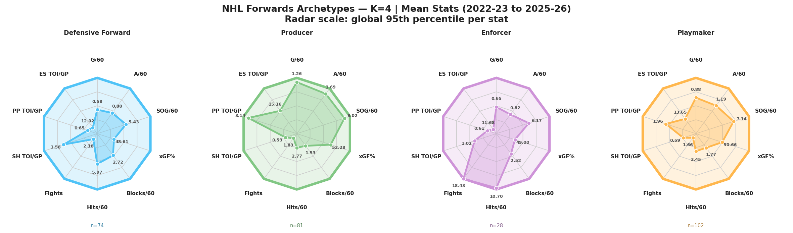
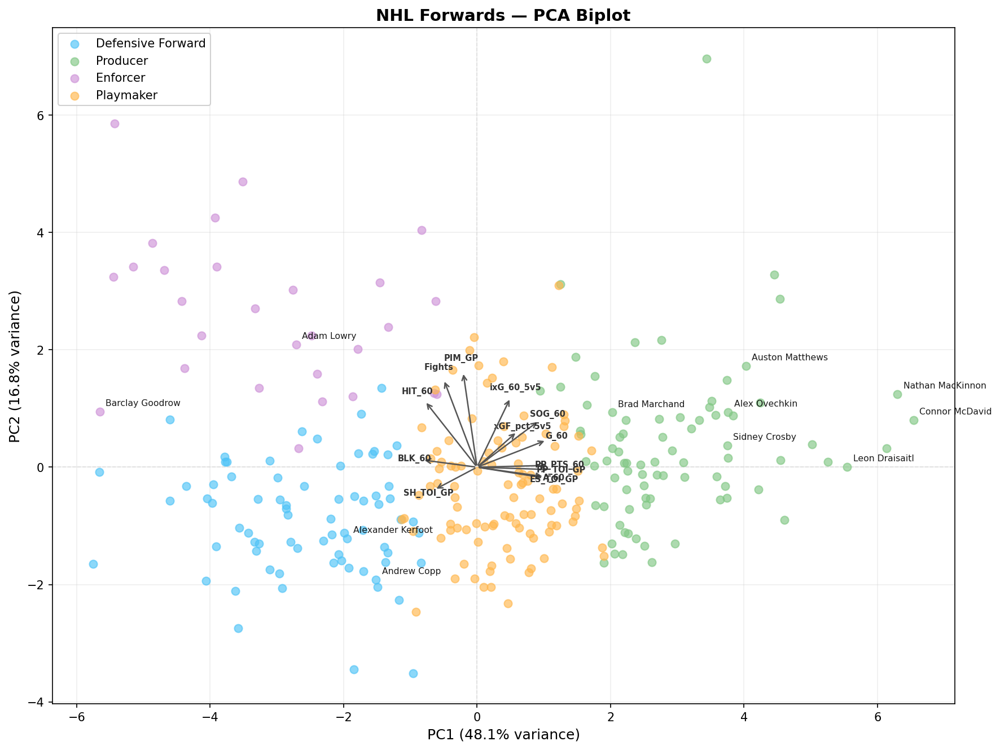
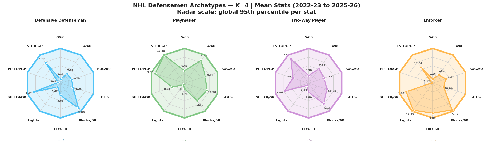
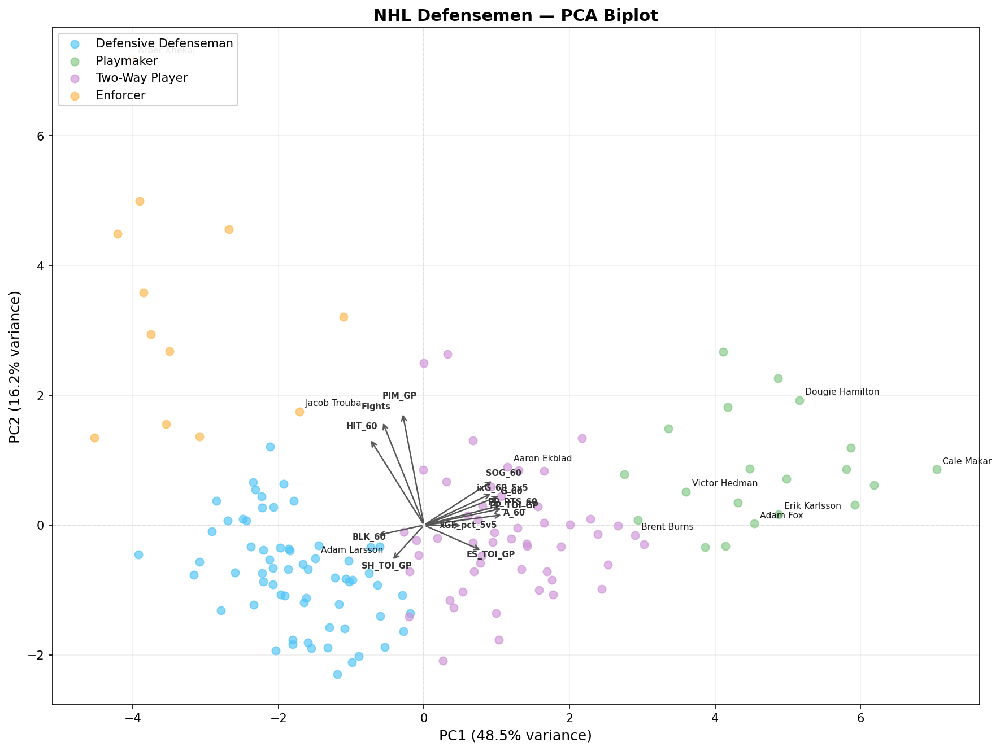

# NHL Skater Archetype Classifier

Unsupervised and supervised machine learning pipeline that clusters **433 qualified NHL skaters** into archetypes based on on-ice statistics, then trains classifiers to reproduce and explain those groupings. Forwards and defensemen are clustered separately. Includes a Streamlit dashboard for interactive player comparison.

---

## Pipeline

```
Data Collection → K-Means Clustering → KNN + Decision Tree → Radar Visualisation → Streamlit Dashboard
```

1. **Data collection** — scrapes Hockey Reference for counting stats and TOI splits, NHL API for player bios and fighting majors, and MoneyPuck for 5v5 advanced stats (xGF%, individual xG). Covers 2022-23 to 2024-25 regular seasons. Players must have played 70% of possible games to qualify.
2. **K-Means clustering** — 13 features standardised per position group. K selected via elbow and silhouette analysis (K=4 for both forwards and defensemen).
3. **Supervised learning** — 80/20 stratified train/test split on K-Means labels. KNN (cross-validated over k=3,5,7,9) for archetype classification; Decision Tree (cross-validated over depth=3–6) for human-readable rules.
4. **Visualisation** — 10-axis radar charts per archetype scaled to 5th–95th percentile range per stat.
5. **Dashboard** — Streamlit app with player search, archetype badge, interactive Plotly radar, and nearest-neighbour comparison table.

---

## The Archetypes

### Forwards (K=4)

| Archetype | n | Profile |
|---|---|---|
| Defensive Forward | ~109 | Two-way contributors — solid across the board but no dominant offensive trait |
| Producer | ~81 | High-end offensive output — elevated G/60, PP production, and xGF% |
| Enforcer | ~29 | Physical agitators — high PIM, fights, and hits; limited offensive role |
| Playmaker | ~66 | Defensive forwards — high SH TOI, low PP involvement, strong possession |

### Defensemen (K=4)

| Archetype | n | Profile |
|---|---|---|
| Defensive Defenseman | ~12 | Physical presence — high fights and hits, limited offensive output |
| Playmaker | ~53 | PP quarterbacks — elevated PP TOI and offensive production from the blue line |
| Two-Way Player | ~20 | Elite offensive D — high G/60, A/60, and xGF% in all situations |
| Enforcer | ~63 | Defensive stalwarts — high BLK/60, heavy ES minutes, shutdown role |

---

## Model Results

| Group | Model | Test Accuracy |
|---|---|---|
| Forwards | KNN (k=5) | **91.2%** |
| Forwards | Decision Tree (depth=6) | 87.7% |
| Defensemen | KNN (k=5) | **86.7%** |
| Defensemen | Decision Tree (depth=4) | 83.3% |

---

## Visualisations

### Forward Archetypes


### Forward PCA Biplot


### Defensemen Archetypes


### Defensemen PCA Biplot


---

## Dashboard

The Streamlit dashboard lets you select any qualified skater and view their archetype profile alongside their nearest neighbours in feature space.

**Features:**
- Position group toggle (Forwards / Defensemen)
- Player search with archetype badge
- Interactive 10-axis Plotly radar — selected player vs neighbours
- Nearest-neighbour table with progress-bar stats
- Same-archetype filter

```bash
streamlit run app.py
```

---

## How to Run

**1. Install dependencies**
```bash
pip install pandas requests beautifulsoup4 scikit-learn matplotlib numpy joblib streamlit plotly
```

**2. Collect data** (or use the included `players_raw.csv`)
```bash
python scrape.py
```

**3. Run the ML pipeline**
```bash
python hockey_ml.py
```

Outputs: `radar_f_K4.png`, `radar_d_K4.png`, `decision_tree_f.png`, `decision_tree_d.png`, `players_clustered.csv`, `knn_model_f.pkl`, `knn_model_d.pkl`, `scaler_f.pkl`, `scaler_d.pkl`

**4. Launch the dashboard**
```bash
streamlit run app.py
```

---

## Files

| File | Description |
|---|---|
| `scrape.py` | Multi-source scraper — Hockey Reference, NHL API, MoneyPuck |
| `hockey_ml.py` | Full ML pipeline — clustering, classification, radar charts |
| `app.py` | Streamlit dashboard |
| `players_raw.csv` | Cleaned input dataset (475 qualified skaters) |
| `players_clustered.csv` | Output dataset with archetype labels |

---

## Data Sources

| Source | Stats |
|---|---|
| [Hockey Reference](https://www.hockey-reference.com) | G, A, SOG, BLK, HIT, PIM, TOI splits |
| [NHL API](https://api.nhle.com) | Height, weight, nationality, fighting majors |
| [MoneyPuck](https://moneypuck.com) | xGF% (5v5), individual xG/60 (5v5) |
